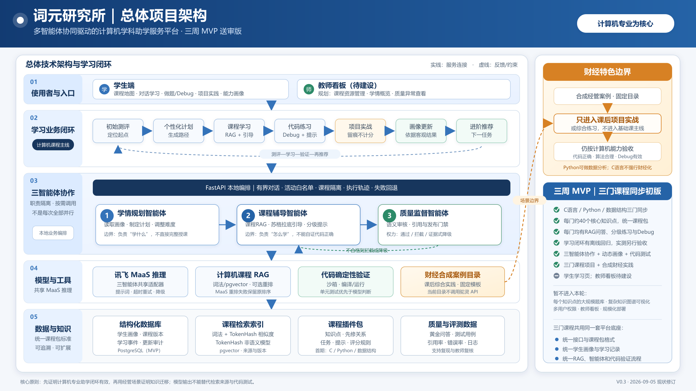

# 词元研究所

**多智能体协同驱动的计算机学科助学服务平台**

面向首都经济贸易大学计算机专业学生，以培养方案和课程资料为知识基础，为 **C 语言、Python、数据结构** 三门课程提供个性化规划、可信辅导、代码实践与学习画像更新。项目当前目标是在三周内完成可演示、可扩展、可验证的初步版本。

> 核心不变：计算机专业课程学习。财经管理元素只进入课程学习后的综合练习，以真实问题背景帮助学生应用编程、算法与数据库能力，不替代课程知识本身。

## 在线演示

- 学生端：<http://39.105.104.230:3004>
- 服务健康检查：<http://39.105.104.230:3004/api/v1/health>

当前为竞赛演示环境，可能受讯飞 MaaS 额度和服务器维护影响；模型不可用时系统会明确显示降级状态，不把固定回退内容冒充为真实模型输出。

## 总体架构



详细说明见 [系统架构](docs/architecture.md)。

## 初步版本范围

- 三门课程同步建设，每门首期整理约 **40 个核心知识点**；
- 每个知识点至少具有学习目标、前置关系、基础内容和测评映射；
- 每门课程均提供问答、分级练习、代码题或 Debug 任务，并跑通一条完整学习流程；
- 跑通“初始测评 → 个性化计划 → 学习辅导 → 练习/Debug → 确定性代码验证 → 画像更新 → 下一任务推荐”；
- Python 以六阶段目标覆盖 40 个主干节点，由助教按画像每次动态组合 2 个节点和真实练习，不使用固定课表；
- 学生端提供独立“项目实战”入口，分为阶段项目、脱敏财经综合项目和自动保存的我的项目；
- 使用数据库保存课程结构、学习记录与学生画像；课程问答优先使用本地 RAG，明确属于 Python 且本地无证据时，受控检索 Python 3.11 中文官方文档；
- 学情规划、三课程辅导、质量监督与受控项目编排统一接入讯飞星辰 MaaS 托管模型；RAG 支持按服务配置接入 MaaS 文档重排，服务异常明确降级；
- 财经综合练习只参考权利明确的公开字段结构，实际使用本地固定合成数据，不调用驼灵；
- 暂不追求生产级高并发、全培养方案覆盖、大规模题库和复杂虚拟仿真实训。

## 三个协同智能体

| 智能体 | 主要职责 | 不负责什么 |
|---|---|---|
| 学情规划智能体 | 分析测评与学习记录，形成阶段目标、学习顺序和下一步推荐 | 不独立判定代码正确性 |
| 课程辅导智能体 | 基于课程知识库讲解、追问、提示、Debug 引导和拓展练习 | 不绕过知识来源直接编造结论 |
| 质量监督智能体 | 以讯飞模型复核语义，以确定性规则检查引用、格式、安全边界与反馈一致性 | 不用语言模型主观判断替代测试结果 |

三个智能体是同一系统内职责清晰的逻辑模块，不是为了数量而拆分的三个独立产品。代码正确性由编译、单元测试、测试用例和资源限制等确定性机制验证，模型负责解释结果和组织反馈。

## 技术路线

```text
Vue 3 / Vite 前端
        ↓
FastAPI 模块化单体后端
        ├─ 智能体编排与学情规划
        ├─ 课程/RAG 与引用
        ├─ 练习、Debug 与代码验证
        ├─ 学习画像与推荐
        └─ 模型适配层（讯飞 MaaS；无凭据时安全降级）
        ↓
PostgreSQL + pgvector / Redis / 受控代码运行环境
```

采用模块化单体是三周初步版本的主动选择：一个后端进程完成部署，各业务模块通过清晰接口隔离；未来确有性能或团队规模需求时再拆分服务。决策记录见 [ADR-0001](docs/adr/0001-modular-monolith-mvp.md)。

## 仓库结构

```text
apps/
  api/                     FastAPI 后端
    app/modules/
      orchestration/       三智能体编排与流程控制
      rag/                 知识入库、检索、引用
      learner_profile/     学生画像、掌握度和学习计划
      practice/            练习、Debug、代码验证
      model_adapters/      讯飞 MaaS、兼容适配与 Mock 降级
  web/                     Vue/Vite 学生端
contracts/                 OpenAPI、JSON Schema 等公共契约
course_packs/
  _template/               课程包统一模板
  c/                       C 语言课程包
  python/                  Python 课程包
  data_structures/         数据结构课程包
infra/                     本地与演示环境
scripts/                   校验、导入和辅助脚本
docs/                      架构、范围、标准与决策记录
.gitee/                    Issue 与 PR 模板
```

## 快速启动初步版本

Windows + Docker Desktop 环境下：

```powershell
.\scripts\setup_demo.ps1 -PullSandboxImages
.\scripts\run_demo.ps1 -EnableCodeExecution
```

打开 `http://localhost:3000`。服务启动后可运行：

```powershell
.\.venv\Scripts\python.exe scripts\demo_smoke.py
```

完整演示顺序、模型配置、安全降级和停止方式见 [初步版本演示与验收手册](docs/demo-runbook.md)。代码执行默认关闭，只有显式传入 `-EnableCodeExecution` 且 Docker 隔离镜像就绪时才开启。

## 协作原则

> **普通成员开始开发前，必须先阅读：[普通成员开发与提交指南](docs/member-workflow.md)。**

1. 一人负责一个 Issue；一个 Issue 对应一个独立分支和一个 PR，Gitee“协作者”字段保持为空；
2. 所有任务分支从最新 `develop` 创建，全体成员禁止直接向 `main`、`develop` 推送；
3. 只修改 Issue 明确允许的目录；公共字段、跨目录修改和范围扩大必须先提出新 Issue；
4. 提交前执行 `.\scripts\check.ps1`，PR 写明改动、测试、风险和可复现证据；
5. 普通成员的 PR 统一由成员1·陈骏人审核、验收和合并，普通成员不得自审或自合并；
6. 成员1自己的 PR，在全量检查通过并记录证据后可以自行审核合并；
7. AI生成代码和课程内容仍由提交者负责，课程内容必须符合 [课程包标准](docs/course-package-standard.md)，数据和模型调用必须符合 [数据与安全边界](docs/data-and-security.md)。

完整流程见 [协作与开发流程](docs/workflow.md)，岗位边界见 [六人岗位分工与独立交付说明](docs/responsibilities.md)，可直接创建到 Gitee 的任务描述见 [单人 Issue 执行手册](docs/collaborator-issues.md)，当前版本边界见 [MVP 范围与验收边界](docs/mvp-scope.md)。

## 本地启动

需要 Python 3.11+、Node.js 20.19+/22.12+ 与 Docker。首次运行使用 PowerShell：

```powershell
Copy-Item .env.example .env
python -m venv .venv
.\.venv\Scripts\Activate.ps1
python -m pip install -e ".[dev]"
docker compose --env-file .env -f infra/compose.yaml up -d
python -m alembic upgrade head
python -m uvicorn app.main:app --app-dir apps/api --reload
```

另开一个终端启动前端：

```powershell
Set-Location apps/web
npm ci
npm run dev
```

默认前端地址为 `http://localhost:3000`，后端文档为 `http://localhost:8000/docs`。提交前在仓库根目录执行 `.\scripts\check.ps1`。真实模型调用前须替换本地 `.env` 中的占位值；`.env` 不得提交。

## 文档索引

- [普通成员开发与提交指南（必读）](docs/member-workflow.md)
- [系统架构](docs/architecture.md)
- [协作与开发流程](docs/workflow.md)
- [六人岗位分工与独立交付说明](docs/responsibilities.md)
- [单人 Issue 执行手册](docs/collaborator-issues.md)
- [MVP 范围与验收边界](docs/mvp-scope.md)
- [课程包统一标准](docs/course-package-standard.md)
- [数据、模型与安全边界](docs/data-and-security.md)
- [初步版本演示与验收手册](docs/demo-runbook.md)
- [MVP v0.3 完整演示版验收记录](docs/audits/mvp-v0.3-acceptance.md)
- [2026-09-05 后端、RAG 与 MaaS 赛事适配审查](docs/audits/backend-competition-maas-review-20260905.md)
- [DATA-01 最小数据模型与迁移](docs/data-model.md)
- [RAG 入库与混合检索](docs/rag-hybrid-search.md)
- [RAG 75 问检索评测](docs/rag-evaluation.md)
- [课堂五角色输入输出回归与修复记录](docs/quality/classroom-role-agent-regression.md)
- [模型服务接入与验收](docs/provider-integration.md)
- [作品六部分说明（PPT统一素材）](docs/presentation-six-part-outline.md)
- [单个PR六部分说明模板](docs/templates/pr-six-part-description.md)
- [贡献指南](CONTRIBUTING.md)
- [AI 编码代理约束](AGENTS.md)

## 当前状态

仓库已形成 `MVP v0.3` 完整演示版：C语言42个、Python40个、数据结构40个知识点已完成结构与内容补齐，
课程内容仍保持 `draft`，并附有 AI 辅助技术复核记录。2026-09-05 仓库审查确认，当前可入库资料为18个来源、60个片段；
75问词法回归的来源级 Recall@5 为100%、MRR为0.9333、库外拒答率100%、跨课程拒答率86.67%、课程隔离率100%。
这些结果不代表答案正确率或全部知识点已获教师审核；本轮未复测真实 pgvector 环境。学习端已跑通知识学习、
学情路径、有来源问答、三级提示、确定性练习与项目证据记录入口。综合项目只做材料完整性检查，
不虚构人工队列或自动分数。历史验收记录记载演示环境已完成讯飞 MaaS 托管
DeepSeek-V4-Flash-0731 的真实联调；本次工作区修复尚未部署或复测该环境。本地未配置凭据时仍使用明确标识的安全降级，
不把 Mock 当作真实调用结果。服务器部署、密钥边界和复现命令见
[服务器部署说明](docs/server-deployment.md)。
